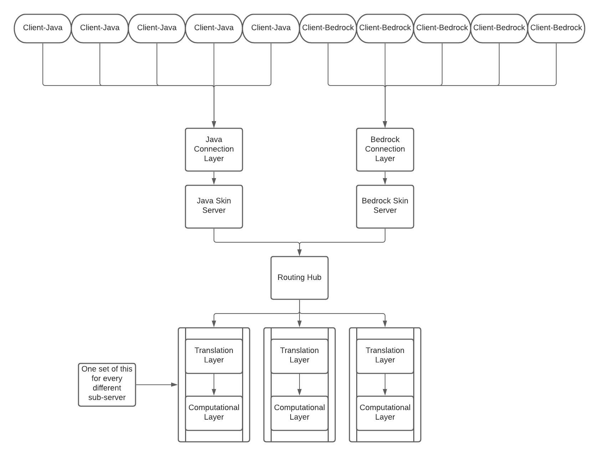

# Welcome to MC Plutonium
## _The Ultimate Cross Platform Minecraft Server._

### What it does:

- Allows Bedrock and Java edition players to play together.
- Extensive Plugin System
- Easily Expandable
- Allows Infinite Custom Content

### Server Structure

| Layer | Purpose |
| ----- | ------- |
| Java Connection Layer | Allow Java Edition clients to connect without specifiying a port |
| Bedrock Connection Layer | Allow Bedrock Edition clients to connect without specifiying a port |
| Bedrock Skin Server | Allows Java Edition clients to see Bedrock client's skins |
| Java Skin Server | Allows Bedrock Edition clients to see Java client's skins |
| Routing Hub | Manage clients connections to servers and manages cross server communications |
| Translation Layer | Manage packets for the attached Computational Layer |
| Computational Layer | Main Processing portion of the server. | 
